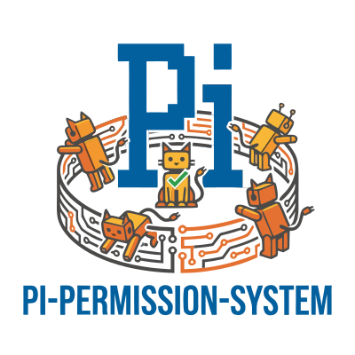

<p align="center">
  
</p>

<h1 align="center">pi-permissions</h1>

<p align="center">
  <a href="https://opensource.org/licenses/MIT"></a>
  <a href="https://www.typescriptlang.org/"></a>
  <a href="https://github.com/Duroxi/pi-permissions"></a>
</p>

<p align="center">
  适用于 <a href="https://pi.mariozechner.at/">Pi coding agent</a> 的统一权限管理扩展，集成三个开源项目的优势。
</p>

## 概览

pi-permissions 是 Pi coding agent 的权限执行引擎。它拦截 agent 的所有工具调用、bash 命令、MCP 调用和技能加载，通过可配置的策略决定 **allow / ask / deny**。

```
工具调用 → 🚪 权限门 → allow → 执行
                    → ask  → 弹出用户确认对话框
                    → deny → 阻止并报错
```

可配置的权限模式让你在不同使用场景间切换：日常开发用 `"allowEdits"` 自动批准写操作、需要完全控制用 `"default"`、信任 agent 时用 `"yolo"`。

## 快速开始

在 `~/.pi/agent/extensions/pi-permission-system/config.json` 创建配置文件：

```jsonc
{
  "mode": "allowEdits",
  "permission": {
    "*": "allow",
    "path": { "*": "allow", ".env": "deny" },
    "bash": { "*": "ask", "rm -rf *": "deny" },
    "external_directory": "ask"
  }
}
```

启动 Pi，扩展自动加载。

## 功能特性

### 权限模式

| 模式 | 行为 |
|------|------|
| `"default"` | 所有 `ask` 状态都需要用户确认 |
| `"allowEdits"` | `write` / `edit` 操作自动批准（仅 CWD 内路径），其余提示确认 |
| `"yolo"` | 所有 `ask` 状态自动批准 |

### 权限状态

| 状态 | 行为 |
|------|------|
| `allow` | 静默放行 |
| `deny`  | 阻止并报错 |
| `ask`   | 弹出 UI 确认对话框 |

### 策略表面

- **path** — 跨工具的文件路径防护（如 `.env` 禁止读取）
- **bash** — bash 命令通配符匹配（如 `rm -rf *: deny`）
- **external_directory** — CWD 外目录访问控制
- **read / write / edit / grep / find / ls** — 逐工具粒度的路径规则
- **mcp** — MCP 服务器/工具级别的访问控制
- **skill** — 技能加载权限

### 安全机制

- **Nonce 绑定** — 子代理权限转发的 IPC 通道使用 32 字节 `crypto.randomBytes` nonce，通过 `timingSafeEqual` 验证，防止伪造响应
- **超时拒绝** — 转发权限提示默认 30 秒超时，超时自动拒绝（fail-safe）
- **ReDoS 防护** — 通配符模式超过 500 字符时使用 `/[^\s\S]/` 永不匹配正则
- **Fail-closed** — 所有内部错误、解析失败、未处理的边界情况默认 deny 或 ask，不会静默 allow

### 交互命令

在 Pi 对话中直接使用：

| 命令 | 作用 |
|------|------|
| `/allow bash gh api *` | 添加允许规则 |
| `/block rm -rf *` | 添加拒绝规则 |
| `/ask write /etc/*` | 添加询问规则 |
| `/policy` | 查看当前策略文件 |
| `/policy-reload` | 重载配置 |
| `/permission-system show` | 查看运行时配置摘要 |

使用 `--global` 标志写入全局配置而非项目配置。

## 集成来源

本项目整合了三个开源权限管理项目的优点：

| 项目 | 集成内容 |
|------|----------|
| [**gotgenes/pi-permission-system**](https://github.com/gotgenes/pi-packages) v18.1.1 | 核心架构：gate pipeline、权限管理器、策略加载、子代理转发、bash 路径解析、完整测试套件 |
| [**MasuRii/pi-permission-system**](https://github.com/MasuRii/pi-permission-system) v0.8.0 | 安全机制：nonce 绑定 IPC、可配置超时拒绝、ReDoS 防护、wildcard 长度上限 |
| [**pi-quick-perms**](https://github.com/Duroxi/pi-quick-perms) | 用户体验：`allowEdits` 模式、快速命令（`/allow` `/block` `/ask`）、紧凑提示格式、三种权限模式枚举 |

## 开发

```bash
npm run check       # TypeScript 类型检查
npm run test        # 运行测试
npm run test:watch  # 监听模式
```

### 测试覆盖

- **2322 个测试**，112 个测试文件
- 跨平台兼容（Windows / POSIX）
- 两轮对抗性安全审查已执行并修复所有发现

## 与 Pi agent 的关系

pi-permissions 是一个 [Pi extension](https://pi.mariozechner.at/)，通过 `package.json` 中的 `pi.extensions` 字段注册。它提供了 `permissions` 服务供其他扩展通过跨扩展 API 访问。

## 许可

[MIT](LICENSE)

Copyright © 2026 Duroxi
